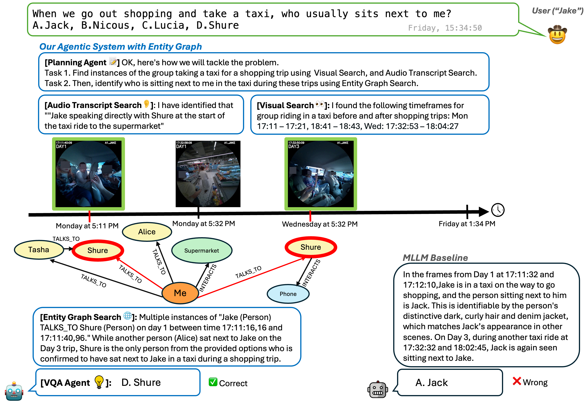

# [Agentic Very Long Video Understanding](https://arxiv.org/abs/2601.18157)
_Aniket Rege, Arka Sadhu, Yuliang Li, Kejie Li, Ramya Korlakai Vinayak, Yuning Chai, Yong Jae Lee, Hyo Jin Kim_

<p align="center">

</p>

Here we provide code for our agentic framework for very long video understanding powered by entity scene graphs, EGAgent. EGAgent consists of a planning agent equipped for multi-hop cross-modal reasoning by querying three tools: a visual search tool, an audio transcript search tool, and an entity graph search tool. We structure this repository as follows:
1. Create Data Sources for Tool Querying
2. Agent Inference
3. Baselines and Evaluation

## Installation
Install prerequisite packages with conda.
```
conda env create -f environment.yml
conda activate egagent
```

## Configure Paths
Update dataset, model, and API key locations in [`paths.py`](paths.py) before running the scripts.

## Set up Multimodal Embedding Model
Download the multimodal embedding model used by EGAgent's visual search tool. We use SigLIP 2 by default, but this can be replaced by the latest state-of-the-art image-text encoder. This repository is the default path to download the embedding model checkpoints, this can be changed to another path in `paths.py`.
```
git lfs install
git clone https://huggingface.co/google/siglip2-giant-opt-patch16-384
```

## Create Data Sources for Tool Querying
We create data sources for the visual search tool and entity graph in [prepare_datasources/](prepare_datasources/README.md). The audio transcripts are queried on the fly and do not require an explicit data source.

## EGAgent Inference
We provide code for EGAgent inference on EgoLife and Video-MME in [egagent/](egagent/README.md).

## Baseline Inference
We provide code to evaluate other baselines on very long video understanding, i.e. multimodal LLMs that uniformly sample frames and transcripts in [baselines/](baselines/README.md).

## Ablations
We provide code to compute retrieval recall of EGAgent tools as well as to generate plots from our paper in [ablations/](ablations/README.md).

## Citation
If you find this project useful in your research, please consider citing:
```
@misc{rege2025agentic,
  title={Agentic Very Long Video Understanding},
  author={Rege, Aniket and Sadhu, Arka and Li, Yuliang and Li, Kejie and Vinayak, Ramya Korlakai and Chai, Yuning and Lee, Yong Jae and Kim, Hyo Jin},
  month={January},
  year={2026},
  eprint={2601.18157},
  archivePrefix={arXiv},
  url={https://arxiv.org/abs/2601.18157},
}
```

## Contribution
See the [CONTRIBUTING](CONTRIBUTING.md) file for how to help out.

## License
This code is CC-BY-NC4.0 licensed, as found in the [LICENSE](LICENSE.md) file.

