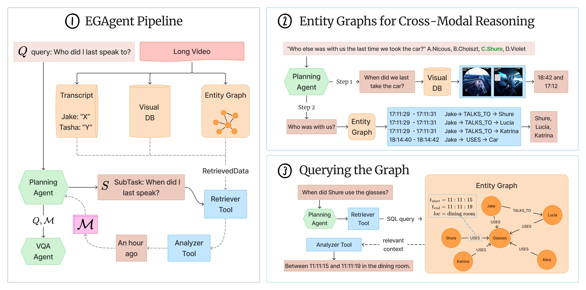

## EGAgent Inference

<p align="center">

</p>

First, update the following values in `langgraph_agent.py`:
1. `dataset`: `videomme` or `egolife`
2. `agent_backbone`: e.g. `gpt-4.1` or `gemini-2.5-pro`

To run EGAgent on EgoLifeQA (500 MCQ pairs):
```
python egagent/run_egagent_on_egolife.py --tscript-search llm
```

Optional flags:
- `--tscript-search {llm,bm25}`: transcript retrieval backend used inside the agent graph
- `--remove-diarization`: strip diarization tags from EgoLife transcripts

To run EGAgent on VideoMME-long (900 MCQ pairs):
```
python egagent/run_egagent_on_videomme.py
```

## [Optional] Batch + Merge results
If using batching, once inference is complete on all batches, merge results to a single json:

```
from utils import merge_batched_results

dataset = 'egolife' # egolife, videomme
agent_backbone = 'gpt-4.1' # gpt-4.1, gemini-2.5-pro, qwen-2.5-vl-7b
config = f'{dataset}_agentic-{agent_backbone}_visual+entitygraph-dtonly-and-dtcaptionfuse+dt-llmsearch_results'

merge_batched_results(config, agent_backbone)
```