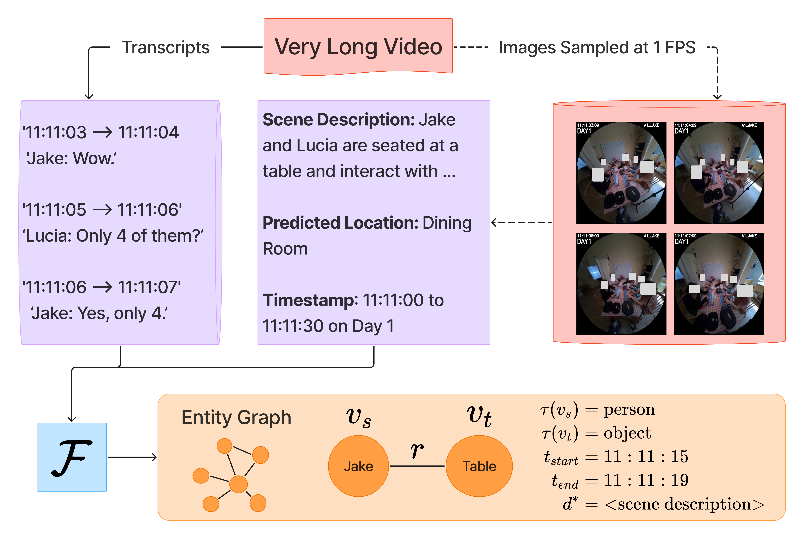

## Download and Prepare Datasets
Download EgoLife and Video-MME datasets and update EGOLIFE_ROOT and VIDEO_MME_ROOT paths in [`paths.py`](../paths.py).
```
cd /path/to/datasets/
git lfs install
git clone https://huggingface.co/datasets/lmms-lab/EgoLife
git clone https://huggingface.co/datasets/lmms-lab/Video-MME

# Extract zipped files in Video-MME (~20 minutes)
bash prepare_videomme.sh
```

## Sample Videos at 1 FPS
First, we sample image frames from the raw long videos at 1 FPS for captioning and entity graph creation.
```
python sample_videos_1fps.py --dataset egolife
python sample_videos_1fps.py --dataset videomme # ~35 minutes
```

## Fuse Audio Transcripts and Captions for Entity Graph Extraction

<p align="center">

</p>

We fuse raw visual captions with diarized audio transcripts using a multimodal LLM (by default, GPT‑4.1). Our default captioner on EgoLife is GPT-4.1 on each 30 second raw video clip sampled at 1 FPS. Our default captioner on Video-MME (Long) is LLaVA-Video-7B (64 image windows of each video sampled at 1 FPS). For Video-MME, we batch across the 300 videos in the Long subset by batch-start index for parallelization across multiple GPUs.

### Arguments

- **`--dataset`**: `egolife` or `videomme` (default: `egolife`)  
- **`--mllm`**: multimodal LLM used for fusion/summarization (default: `gpt-4.1`)  
- **`--day`**: EgoLife day (1–7). Used only when `--dataset egolife` (default: `1`).  
- **`--batch-start`**: For Video-MME (Long), 0-based start index of the long-video batch to process (default: `0`).  
- **`--batch-size`**: For Video-MME (Long), number of long videos to process starting from `--batch-start` (default: `50`).  

### Examples

**Fuse transcripts and captions on day 1 of EgoLife:**
```bash
python summarize_and_fuse_captions.py \
  --dataset egolife \
  --mllm gpt-4.1 \
  --day 1
```

**Fuse transcripts and captions on Video-MME (Long):**

By default, we run this in parallel with 6 batches of 50 videos each, i.e. `batch-start` $= \{0, 50, 100, 150, 200, 250\}$. For example, for the third batch containing the 100 - 150th videos in Video-MME (Long):
```bash
python summarize_and_fuse_captions.py \
  --dataset videomme \
  --mllm gpt-4.1 \
  --batch-start 100 \
  --batch-size 50
```

## Create Entity Graph from Fused Transcript + Caption
We then convert the fused captions + transcripts into an entity graph with timestamps, saved to JSONs.

### Arguments

- **`--dataset`**: `egolife` or `videomme` (default: `egolife`)  
- **`--day`**: EgoLife day index (1–7). Used only when `--dataset egolife` (default: `6`).  
- **`--batch-start`**: For Video-MME (Long), 0-based start index of the long-video batch to process (default: `0`).  
- **`--batch-size`**: For Video-MME (Long), number of long videos to process starting from `--batch-start` (default: `50`).  

### Examples

**Create entity graph on day 6 of EgoLife:**
```bash
python create_entity_graph.py \
  --dataset egolife \
  --day 6
```

**Create entity graphs on Video-MME (Long):**
Similar to transcript-caption fusion above, since all Video-MME videos are independent, we create entity graphs separately on all 300 videos in parallel with batching. For example, for the fifth batch containing the 250 - 300th videos in Video-MME (Long):
```bash
python create_entity_graph.py \
  --dataset videomme \
  --batch-start 250 \
  --batch-size 50
```

## Prepare EG Database (SQLite)
After creating the entity graph JSONs with `create_entity_graph.py`, here we build the SQLite table(s) that EGAgent queries at inference. In our paper, we use GPT-4.1 captions on EgoLife, and LLaVA-Video-7B captions on Video-MME (Long).

### Arguments

- **`--dataset`**: `egolife`, `videomme` (default: `egolife`).
- **`--config`**: Config folder name under `TIMESTAMP_EPISODES_ROOT`, e.g. `fused_dt_and_gpt-4.1_captions`, `fused_dt_and_llava-video-7bcaptions`.

### Examples

**EgoLife with fused diarized transcripts + GPT-4.1 captions:**
```bash
python create_db_entity_graph.py --dataset egolife --config fused_dt_and_gpt-4.1_captions
```

**Video-MME (Long) with fused transcripts + LLaVA-Video-7B captions:**
```bash
python create_db_entity_graph.py --dataset videomme --config fused_dt_and_llava-video-7bcaptions
```

**Outputs:** 
1. EgoLife → single DB at `DB_ROOT/entity_graph/egolife_entity_graph_{config}.db`.
2. Video-MME (Long) → one DB each for all 300 videos under `DB_ROOT/entity_graph/videomme/{config}/videomme_{video_id}.db`.

## Prepare Visual Database (SQLite)
We now embed the frames sampled at 1 fps with a strong vision encoder (we use SigLIP 2), and add these embeddings to a table for EGAgent to query during inference. On EgoLife, this process takes around 3 hours with sufficient CPU memory for image loading from disk (~40 GB) and GPU memory for embedding batch inference (2 × 24 GB = 48 GB with RTX 4090s).

Select the dataset as well as the embedding batch size and approximate CPU RAM cap for image loading according to your compute resources.

- **`--dataset`**: `egolife` or `videomme`  
- **`--batch-size`**: embedding batch size for EgoLife frame encoding (default: `256`)  
- **`--max-ram-gb`**: approximate maximum CPU RAM in GB used for loading EgoLife frames in chunks (default: `40.0`)

### EgoLife:
We embed frames and create the embedding table in one step separately for each day (1 to 7). We later merge the tables for each day into one table.
```bash
python create_db_visual_frames.py \
  --dataset egolife \
  --batch-size 256 \
  --max-ram-gb 40
```

### Video-MME (Long):
On Video-MME, we load pre-computed embeddings (.npy) for all 300 videos in the Long subset. Set VMME_EMBS_PATH in `paths.py`
```bash
python create_db_visual_frames.py --dataset videomme
```
